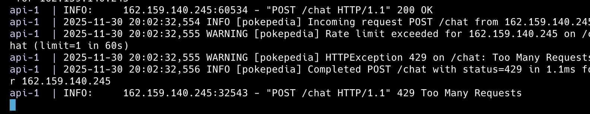

# Self Assessment

## Machine Learning

#### 1. Completed project individually without a partner (10 pts)

This was an individual project, I did not have a partner.

#### 2. Collected or constructed original dataset through substantial engineering effort (e.g., API integration, web scraping, manual annotation/labeling, custom curation) with documented methodology (10 pts)

The data sets can be found in [/data](../data) and the documented methodology can be found in this [doc](../docs/DATASET_CREATION.md). 

For a brief synopsis, the constructed original dataset is the [rag-chunks](../data/rag/json-data/rag-chunks.zip) that are used in retrieval for my RAG system. 

The information gathered was done through **web scraping** [PokemonDB](
https://pokemondb.net), however the final output was more than just a dump of the web scraped results. The chunks were constructed through parsing of the information using html DOM traversal, and then formating that information in a specify way to be better for retrieval and appear in natural language form (**custom curation**).

#### 3. Built retrieval-augmented generation (RAG) system with document retrieval (e.g., from a static dataset/database, or from dynamic web search/scraping) and generation components (10 pts)

The main implementation of how the chatbot answers is through a RAG system. This is done in [chatbot_logic](../src/pokepedai-backend/app/chatbot_logic.py).

The function `dense_search` (line 60) does document retrieval from the from the static dataset created in the rubric item above, and the function `answer` (line 205) uses this context in its generation components.

(While there is a recursive RAG implementation, the base RAG implementation can be seen from just the interaction of these two functions.)

#### 4. Deployed model as functional web application with user interface (10 pts)

Here is the [web app](https://cs372-jc939.vercel.app). The website provides a functional web applification with a user interface to interact with the deployed backend chat logic. 

#### 5. Implemented production-grade deployment (evidence of at least two considerations such as rate limiting, caching, monitoring, error handling, logging) (10 pts)

**Rate Limiting**

Rate limiting, is implemented in this file [rate_limiter](../src/pokepedai-backend/app/rate_limiter.py) and then applied in [main.py (line 127)](../src/pokepedai-backend/app/main.py). The current setup applies rate limiting per IP address currently to 10 limits within a sliding window of 60 seconds. Since this is hard to verify by testing, since it is hard to send 10 within 60 seconds, I set the limit to 1 in 60 seconds to demonstrate it working.

**Logging**

The next one is logging, logging is implemented throughout the backend. The setup from logging is found in [main.py (line 15, 81)](../src/pokepedai-backend/app/main.py) and an example of calling it within the chatbot logic can be found in [chatbot_logic (line 64, 70, 82)](../src/pokepedai-backend/app/chatbot_logic.py). 

The logging is at two levels, info which simply prints which step of the process it is at, and debug (which only prints if debug = True) which contains more in depth information in what is happening during each step.

You can see the logs both when you run locally, but also in the deployed backend monitoring.

**Error Handling**

Errors are handled gracefully in the frontend in [useChatSession (line 169-177)](../src/pokepedai-frontend/hooks/useChatSessions.ts) and logged in the backend (ex. [chatbot_logic (line 70)](../src/pokepedai-backend/app/chatbot_logic.py)). This adheres with standard production grade deployment where you want errors to be recognized but not break things.

#### 6. Built multi-turn conversation system with context management and history tracking (7 pts)

Conversations are not only saved per session, but also across sessions and chats on the frontend. This is handled by [useChatSessions](../src/pokepedai-frontend/hooks/useChatSessions.ts)

While typically conversations should not be stored in the frontend, but rather managed by an intermediary database, due to the scale of the project, caching on the frontend should be sufficient. 

Additionally, I believe this still shows substantial effort as all the logic applying to content management and history tracking would be the same if I did use a database. The only thing that would change is in retrieving message history and adding message history, it would have to send a request to the database instead.

Lastly, we can see the integration of multi-turn conversation in the backend in [chatbot_logic's `rewrite_query_with_history` (line 106)](../src/pokepedai-backend/app/chatbot_logic.py).

This allows the backend to consider history when answering the question.

Note: while typically in the final `answer` generation would provide the chat context, due to once again the scope of the project, and also the limitations based on system choices, in order to reduce the number of tokens as input to the open ai model, chose to not include it in answer. While this means that the final answer may not answer with information from the conversation, queries are still properly interpretted due to `rewrite_query_with_history`. Additionally, in the future with more resources, it is very simple to address this by just editing the prompt to add in history right above context. Thus, I think this choice this not take away from this being a multi-turn conversation system due to the main purpose of this project.

#### 7. Made API calls to state-of-the-art model (GPT-4, Claude, Gemini) with meaningful integration into your system (5 pts)

In this project, I made API calls to GPT's model for example in [chatbot_logic's `rewrite_query_with_history` (line 106)](../src/pokepedai-backend/app/chatbot_logic.py). Additionally, calls are also made in `sufficient`, `rewrite`, and `answer`.

These all play a meaningful integration into the system.
- rewrite_query_with_history: This query calls the GPT model to rewrite the user question with the context so the question can be a standalone content.
- sufficient: This query calls the GPT model to determine if the given retrieval is enough to answer the question.
- refinement: This query uses the model to rewrite the prompt based on new chunk information if possible.
- answer: This query generates the response based on the returned documentation.

#### 8. Modular code design with reusable functions and classes rather than monolithic scripts (3 pts)

All code in notebooks, backend, and frontend are functions/classes and not monolithic scripts. Take [chatbot_logic](../src/pokepedai-backend/app/chatbot_logic.py) for example. It's core methods (i.e. doing document retrieval, making API calls) are in their own functions, and util functions such as constructing the prompt or history context are found in util functions and then imported into the logic.

#### 9. Used sentence embeddings for semantic similarity or retrieval (5 pts)

Sentence embeddings are used to encode each RAG chunk in [PokemonDocEncoder](../notebooks/PokemonDocEncoder.ipynb), and then to encode the query in [chatbot_logic (line 67)](../src/pokepedai-backend/app/chatbot_logic.py). Lastly, for retrieval, semantic similarity is compared in [chatbot_logic's `dense_search` (line 60)](../src/pokepedai-backend/app/chatbot_logic.py).

#### 10. Applied in-context learning with few short examples or chain of thought prompting (5 pts)

In-context learning as well as chain of thought prompting can be seen in the [prompt for sufficiency](../src/pokepedai-backend/app/chatbot_utils/prompt_provider.py). On lines 51-66 we can see the 3 examples of the task, and in the answer of these examples we can see the chain of thought prompting.

Total: 75

## Following Directions

- Ontime submission by 5 pm on Tuesday, December 9th (note that late submissions will be accepted but only for the normal 72 hour late period, and will not qualify for this rubric item). (3 pts)
- Self-assessment submitted that follows guidelines for at most 15 selections in Machine Learning with evidence (note that failing to submit a self-assessment may result in a loss of credit for some overlooked rubric items during grading). (3 pts)
- SETUP.md exists with clear, step-by-step installation instructions (2 pts)
- ATTRIBUTION.md exists with detailed attributions of all sources including AI-generation information (2 pts)
- requirements.txt or environment.yml file is included and accurate (2 pts)
- README.md has What it Does section that describes in one paragraph what your project does (1 pts)
- README.md has Quick Start section that concisely explains how to run your project (1 pts)
- README.md has Video Links section with direct links to your demo and technical walkthrough videos (1 pts)
- README.md has Evaluation section that presents any quantitative results, accuracy metrics, or qualitative outcomes from testing (1 pts)
- Demo video is of the correct length and appropriate for non-specialist audience with no code shown (2 pts)
- Technical walkthrough is of the correct length and clearly explains code structure, ML techniques, and key contributions (2 pts)

Total: 20 pts 

## Project Cohesion

- README clearly articulates a single, unified project goal or research question (3 pts)
- Project demo video effectively communicates why the project matters to a non-technical audience in non-technical terms (3 pts)
- Project addresses a real-world problem or explores a meaningful research question (3 pts)
  - All 3 of these articulate one purpose stemming from 1 motivation. As mentioned in the demo video the reason why this project matters is because of how much information is necessary in order to play Pokemon games, players often amass many tabs and have to search throughout different websites during their game play. Thus, the purpose of this project, is to address this existing problem to centralize in one location answers to these questions.
- Technical walkthrough demonstrates how components work together synergistically (not just isolated experiments) (3 pts)
- Project shows clear progression from problem → approach → solution → evaluation (3 pts)
- Design choices are explicitly justified in videos or documentation (3 pts)
- None of the major components awarded rubric item credit in the machine learning category are superfluous to the larger goals of the project (no unrelated "point collecting") (3 pts)
  - The technical walkthrough show cases how the components work together to solve the problem, design choices are justified in the video and if not in the video extra documentation can be found [here](../docs/DESIGN_CHOICES.md), in this document can also see how choices regarding points in the ML were made to either solve the central problem or problems that arose throughout development.
- Clean codebase with readable code and no extraneous, stale, or unused files (3 pts)

Total: 24 pts (Though would be capped at 20)